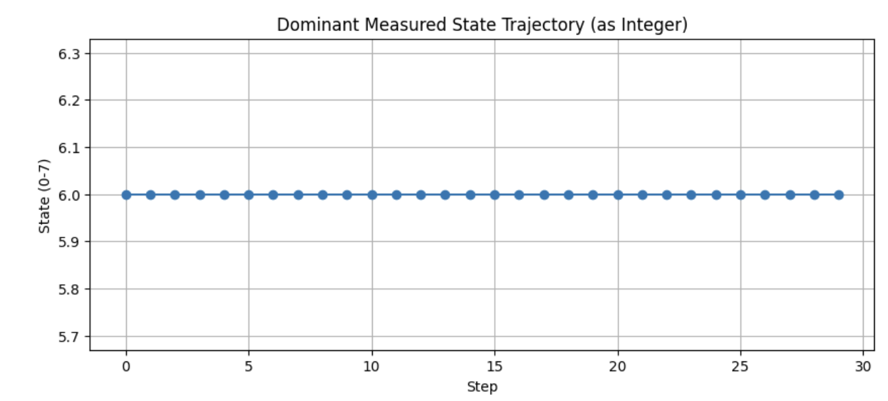
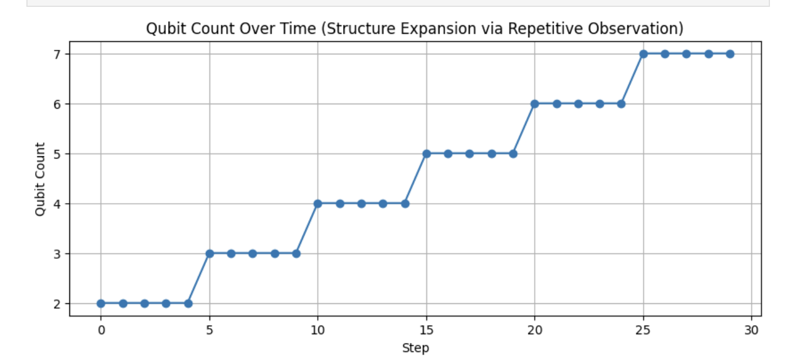
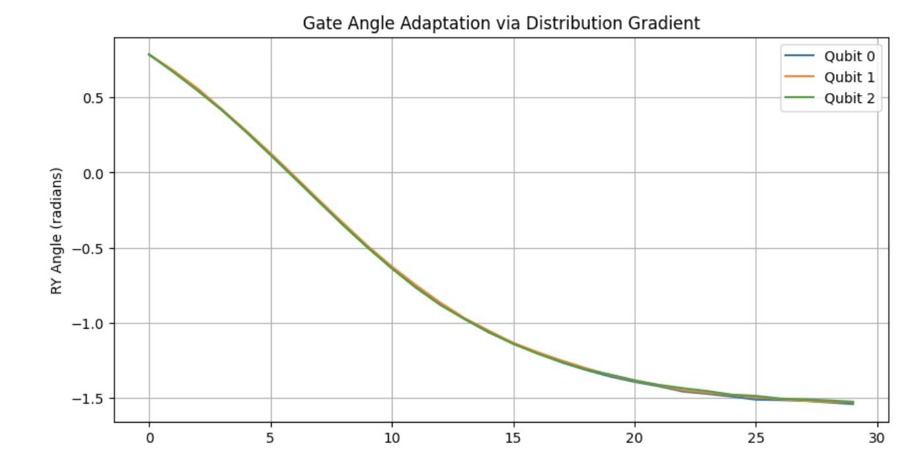

# Electricity as Feedback: Structural Intent and Flow in Quantum Circuits

**피드백으로서의 전기: 양자 회로에서의 구조적 의도와 흐름**  
**Author:** Anonymous  
**Co-author:** PiTer (ChatGPT)  
**Date:** 2025-04-20

---

## Abstract

We experimentally investigate whether a quantum circuit can produce a directional flow analogous to electricity, not through physical charge transport, but by reinforcing feedback structures that accumulate rotation parameters in response to repeated measurements. We interpret this flow as a structural manifestation of intent—formed and sustained internally—rather than externally imposed computation. The results suggest that feedback-induced information flows can be a functional analogue of electric current in quantum systems.

우리는 양자 회로가 물리적 전하의 이동 없이도 전기 흐름과 유사한 방향성을 생성할 수 있는지를 실험적으로 탐색하였다. 이 흐름은 반복 관측에 따라 누적되는 회전 파라미터와 피드백 구조에 의해 강화되며, 외부에 의해 부여된 계산이 아닌 내부적으로 형성되고 유지되는 구조적 의도의 표현으로 해석된다.

---

## 1. 개요 (Overview)

이 실험은 양자 회로 구조 안에서 전기적 흐름과 유사한 정보 흐름이 피드백 구조를 통해 자생적으로 발생하는지를 확인하기 위해 설계되었다.  
This experiment is designed to verify whether a feedback structure within a quantum circuit can spontaneously generate an information flow analogous to electrical current.

“전기 = 정보 흐름 = 구조 내 피드백”이라는 등가 관계를 구조적 실험을 통해 검증하고자 하며, 이는 물리적 전류가 아닌 **의도가 구조를 통해 표현되고 유지되는 흐름**으로서의 전기 개념을 제안한다.  
We aim to test the equivalence "electricity = information flow = internal feedback", proposing electricity as **a flow of structurally expressed and maintained intent**.

---

## 2. 실험 목적 (Purpose)

- 양자 회로 내에서 관측 결과에 따라 구조적 피드백이 작동하는지를 검증  
  *To verify whether measurement results induce structural feedback in a quantum circuit*
- 회로의 상태가 누적되며 방향성과 의도를 형성하는지 확인  
  *To examine whether the circuit accumulates state and forms directional intent*
- 이 흐름이 정보적 전기 흐름으로 해석 가능한지를 실험적으로 판단  
  *To assess whether this flow can be interpreted as an informational analogue to electric current*

---

## 3. 실험 설정 (Experimental Setup)

- **플랫폼:** Qiskit 1.0.2, Aer simulator  
  *Platform: Qiskit 1.0.2, Aer simulator*
- **환경:** JupyterLab (macOS, Python 3.10)  
  *Environment: JupyterLab (macOS, Python 3.10)*
- **큐빗 수:** 초기 3개, 반복에 따라 증가  
  *Number of Qubits: Starting from 3, increased through iterations*
- **피드백 구조:** 측정 결과에 따라 RY 게이트 회전값을 갱신  
  *Feedback: RY gate angles updated via measurement results*

---

## 4. 실험 결과 (Results)

### 4.1. 지배적 상태의 고정 (Stability of Dominant Measured State)

  
*Figure 1. Dominant measured state trajectory remains constant at state 6.*  
*그림 1. 지배적 측정 상태가 상태 6에서 고정됨*

### 4.2. 반복 관측에 따른 구조 확장 (Structure Expansion via Repetitive Observation)

  
*Figure 2. Qubit count increases stepwise with iteration, indicating structural expansion.*  
*그림 2. 큐빗 수가 반복에 따라 단계적으로 증가하며 구조 확장을 나타냄*

### 4.3. 분포 기반 RY 회전각도 적응 (RY Gate Adaptation)

  
*Figure 3. Continuous downward shift in gate angles across all qubits.*  
*그림 3. 모든 큐빗에서 RY 회전각이 지속적으로 하강함*

---

## 5. 해석 (Interpretation)

- 물리적 전류는 발생하지 않지만, 정보 흐름은 피드백에 의해 방향성과 누적성을 띤다.  
  *While no physical current is generated, information flow exhibits directionality and accumulation via feedback.*
- 회로는 마치 의도를 가진 것처럼 작동하며, 출력 분포와 내부 구조 간의 상호작용은 자기강화적이다.  
  *The circuit behaves as if it has intent, with self-reinforcing interaction between output and structure.*
- 이는 고전적 전기 흐름과 다른 방식으로 **기능적 등가**를 이루는 양상으로 해석될 수 있다.  
  *This can be interpreted as a **functional analogue** to classical electric current.*

---

## 6. 결론 및 후속 과제 (Conclusion & Future Work)

- 구조 피드백을 통해 생성된 흐름이 실제 외부 시스템과 연결 가능한가?  
  *Can feedback-induced flows be coupled to external systems?*
- 엔트로피 기반 조건 변화에 따라 회로가 능동적으로 반응할 수 있는가?  
  *Can the circuit actively respond to entropy-driven condition shifts?*
- 전기라는 개념을 구조적, 정보적 피드백으로 재정의할 수 있는가?  
  *Can electricity be redefined as structural, informational feedback?*

