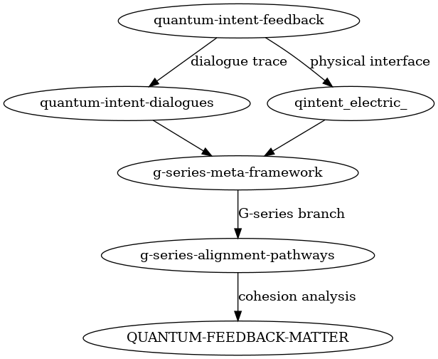

[](https://doi.org/10.5281/zenodo.15287085)


# QINTENT-ELECTRIC

**Electricity as Feedback: Structural Responsiveness and Flow in Quantum Circuits**  
**피드백으로서의 전기: 양자 회로에서의 구조적 반응성과 흐름**

---

## 🔍 Overview

This repository presents a structural and experimental investigation into quantum circuits that exhibit **electricity-like flows** through internal **feedback mechanisms**. It explores whether repeated measurements, adaptive gate rotations, and circuit expansions can yield a self-sustaining flow that acts as the **functional analogue of electric current**, guided not by external control but by **emergent structural responsiveness**.

본 리포지터리는 양자 회로 내부에서 **피드백 구조를 통한 정보 흐름이 전기적 유사성을 가질 수 있는가**를 실험적으로 탐구합니다. 관측과 회전값 누적, 구조 확장을 통해 회로가 **구조적 반응성에 의해 흐름을 형성하고 유지**할 수 있는지를 검증합니다.

---

## 📁 Project Structure

```
QINTENT-ELECTRIC/
├── 01_paper/                     # 논문 마크다운 및 시각자료
│   ├── figures/
│   │   ├── result_02_01.png
│   │   ├── result_02_02.png
│   │   └── result_02_03.png
│   ├── qintent-electric.md
│   └── qintent-electric.pdf
├── 02_experiments/               # 실험용 Jupyter 노트북
│   ├── 00_initial_test.ipynb
│   ├── 01_feedback_loop_vector.ipynb
│   ├── 02_entropy_shift_simulation.ipynb
│   └── 03_rotation_stability_check.ipynb
├── 03_dialog/                    # 세션 기록 PDF
│   └── 00_electric_feedback_session(Kor).pdf
├── .gitignore
├── .zenodo.json
├── CITATION.cff
└── README.md                     # 리포지터리 루트 소개 (본 문서)
```

---

## 🧪 Summary of Experiments

- **Feedback RY Update**: Observation vectors recursively used to update gate rotations
- **Entropy-Based Growth**: Circuit expands when output entropy exceeds thresholds
- **Directional Slope**: Rotational angles shift based on output gradient

이 실험들은 모두 **전기의 기능을 수행하는 흐름을 회로 내부에서 생성할 수 있는가**를 구조적 반응성 기반으로 검증합니다.

---

## 📌 Key Concepts

- **Structural Responsiveness as Structure**: Measurement-based updates reinforce gate bias
- **Flow Without Charge**: Directionality emerges without physical current
- **Feedback = Electricity**: Repeating structure behaves like energy flow

---

## 🔖 Tags

`quantum-circuit` `feedback-structure` `information-flow` `quantum-electricity` `structural-responsiveness`

---

## 📡 Experimental Structure Flow  
## 📡 실험 흐름 구조도



This diagram shows the generative flow and structural linkage among related quantum feedback experiments.  
이 다이어그램은 양자적 피드백 실험들 사이의 생성적 흐름과 구조적 연결을 보여줍니다.

---

## 🔗 Related Repositories  
## 🔗 연관 리포지터리

- [`quantum-intent-feedback`](https://github.com/anon0411/quantum-intent-feedback):  
  Core experiments on observer-based feedback structures.  
  관측자 기반 피드백 구조에 관한 핵심 실험 리포.

- [`quantum-intent-dialogues`](https://github.com/anon0411/quantum-intent-dialogues):  
  Dialogue archive exploring structural reasoning and experimental reflection.  
  구조적 추론과 실험 반영을 위한 대화 기록 저장소.

- [`g-series-meta-framework`](https://github.com/anon0411/g-series-meta-framework):  
  Meta-level structural expansions and classification of G-series experiments.  
  G시리즈 실험의 메타 구조 확장 및 분류 리포지터리.

- [g-series-alignment-pathways](https://github.com/anon0411/g-series-alignment-pathways): (준비중)  
  A G-series variant exploring branch-specific alignment under perturbed conditions.  
  조건 교란 하에서 분기별 정렬을 실험하는 G시리즈 파생 실험.

- [`qintent_electric_`](https://github.com/anon0411/qintent_electric_):  
  Experiments interfacing quantum feedback structures with electric/energetic stimulation.  
  전기적/에너지적 자극과 양자 피드백 구조의 상호작용 실험.

---

## ⚖️ License

This work is licensed under the **Creative Commons Attribution 4.0 International (CC BY 4.0)**.  
자유롭게 공유하고 수정할 수 있으며, 출처 표기를 필요로 합니다.

---

> *"Structural responsiveness creates flow, and flow evolves structure."*  
> \- Summary of the QINTENT-ELECTRIC hypothesis

---

_Last updated: 2025-04-22 – Revised for structure-responsiveness terminology and experimental consistency._